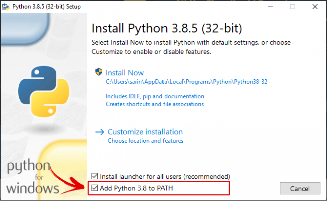
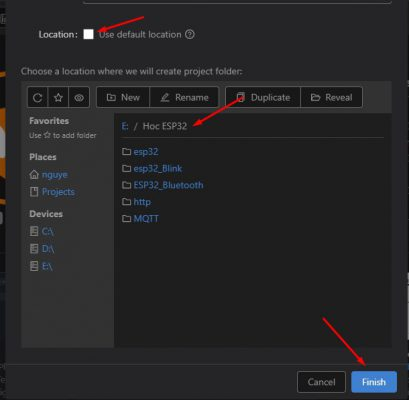
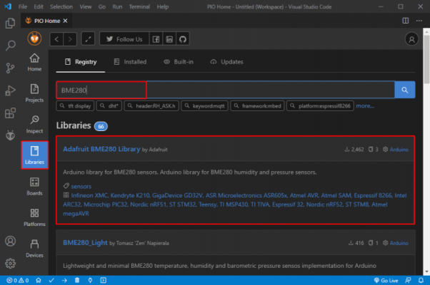
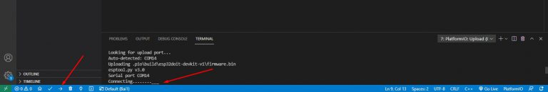
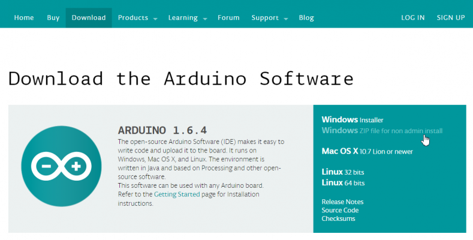
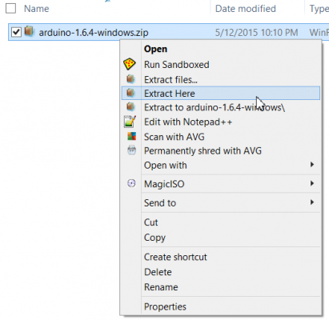
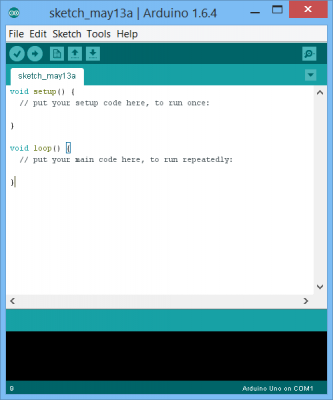

# I. Cài đặt và sử dụng phầm mềm
## 1. Platform IO lập trình ESP32
**Ứng dụng trong dự án:** Lập trình vi điều khiển ESP32 cho End Devices và Gateway.

[Link hướng dẫn chi tiết](https://khuenguyencreator.com/huong-dan-cai-dat-platform-io-lap-trinh-esp32/)
## Cài đặt Visual Studio Code (VS Code)
Truy cập link: https://code.visualstudio.com/
Download và Cài đặt như một software bình thường.
## Cài đặt Platform IO
Trước khi cài Extension này, chúng ta cần cài đặt Python cho máy tính đã.

Truy cập link: https://www.python.org/downloads/.  
**Lưu ý**: Hãy tích chọn Add Python 3.8 to PATH để có thể run Python ở bất cứ đâu.  
Sau đó mở VS code, chuyển đến tab Extension, trong ô tìm kiếm gõ    **Platformio IDE**.
Nhấn cài đặt, sau khi cài đặt xong sẽ hiển thị như hình:

  
Restart lại VS code sau đó chờ cho tất cả các extension được load.
**Lưu ý:** máy tính bạn cần phải có mạng nhé.
## Cài đặt Driver nạp cho mạch.
Tùy vào trường hợp mạch bạn sử dụng IC UART nào, chúng ta sẽ cài đặt driver cho chip đó:
Thường là 2 loại:
CP210x: [Link download và cài đặt](https://sparks.gogo.co.nz/ch340.html).
CH340:  [Link download và cài đặt](https://sparks.gogo.co.nz/ch340.html).
## Hướng dẫn sử dụng Platform IO lập trình ESP32
Tạo một dự án lập trình ESP32 với Platform IO.
Chúng ta nhấn vào biểu tượng logo của Platform io, trong tab Quick Acccess nhấn Open. Vs code sẽ mở ra trang PIO Home.
Sau đó nhân vào New Project để tạo 1 dự án mới
Đặt tên dự án, Chọn KIT sử dụng, ở đây là board DOIT ESP32 DEV KIT (loại thường gặp nhất đó).
Chọn Framwork là Arduino:

Bỏ tick Use Defaul Location, sau đó trỏ tới nơi bạn lưu project, nhấn Finish để hoàn thành.

Giao diện lập trình của Platform IO
Sau khi project được tạo, giao diện như sau:

**Gồm :**
- **Phần cây thư mục dự án:** cho chúng ta thêm, sửa, xóa các file nhanh
Phần Text editor: là nơi viết code
- **Cửa sổ Terminal:** Nơi gõ các câu lênh
**Thanh công cụ:** Lần lượt là Home, Build, Upload code, Clean, Serial Monitor(màn hình serial), Terminal
- **Thư mục Src:** Chứa Source code của chương trình, đây là nơi lưu trữ code và bạn sẽ code trên đó. File thực thi chính là: main.cpp
**Ứng dụng trong dự án:** Lập trình vi điều khiển ESP32 cho End Devices và Gateway

Trên thực tế, các bạn có thể Copy trực tiếp các đoạn code viết bằng Arduino IDE và Paste thẳng vào đây. Chỉ cần giữ **#include <Arduino.h>** là code cũng có thể chạy bình thường.  
Thế nên các dự án mà bạn viết bằng Arduino cũng đều có thể viết bằng VS code nhé.   
File platformio.ini là file cấu hình PlatformIO cho project của bạn. Nó hiển thị các thông tin như platform, board và framework được sử dụng. Bạn cũng có thể thêm các cấu hình khác như các thư viện được đưa vào, tùy chọn upload code, hay tốc độ truyền của Serial Monitor, đường dẫn thư viện và các cấu hình khác.  
Thực tế các bạn nên để nguyên.  
Nếu muốn thay đổi tốc độ baud của Serial Monitor có thể sử dụng lệnh: **monitor_speed = 115200**.  
Nếu muốn thêm đường dẫn của thư viện chúng ta dùng: lib_deps = E:/thuvien   
Trong đó E:/thuvien là đường dẫn tới file thư viện bạn cài đặt  
## Cài đặt thư viện cho Platformio   
### Sử dụng công cụ Libraly trong Platformio  
- Làm theo quy trình dưới đây nếu bạn cần cài đặt thư viện trong PlatformIO IDE.  
- Nhấp vào biểu tượng Home để chuyển đến Trang chủ PlatformIO. Nhấp vào biểu tượng Libraries trên thanh bên trái.  
- Tìm kiếm thư viện bạn muốn cài đặt. Ví dụ Adafruit_BME280 .  

Nhấp vào thư viện bạn muốn đưa vào dự án của mình. Sau đó, nhấp vào Add to Project.  

Chọn dự án bạn muốn sử dụng thư viện.

Thao tác này sẽ thêm code định danh thư viện bằng cách sử dụng lid_depschỉ thị trên file platformio.ini . Nếu bạn mở file platformio.ini của dự án , nó sẽ trông nh thể hiện trong hình ảnh sau.  

Ngoài ra, trên cửa sổ thư viện, nếu bạn chọn tab Installation và cuộn một chút, bạn sẽ thấy code định danh cho thư viện. Bạn có thể chọn bất kỳ số nhận dạng nào tùy thuộc vào tùy chọn bạn muốn sử dụng. Các mã nhận dạng thư viện được đánh dấu màu đỏ.

## Build và Upload code cho ESP32 bằng Platform IO
Mình sẽ chọn một example huyền thoại là Blink Led trên Arduino IDE, copy đoạn code đó, sau đó paste vào VS code

Nhớ giữ lại **#include <Arduino.h>** nhé!

Sau đó nhấn Build để biên dịch chương trình, Khi terminal báo Success là ok. Nếu chương trình có lỗi, hãy chuển tab Problems để view lỗi nhé!
Cắm mạch vào và nhấn Upload, nếu đến đoạn connecting mà vscode ko tìm thấy esp, các bạn nhấn nút BOOT trên mạch giữ 1 chút rồi nhả ra nhé. Để ESP vào chế độ Nạp.

Sau khi nạp xong, thì xem thành quả thôi!!!
  
## 3. Arduino
**Ứng dụng trong dự án:** UART để hiển thị các dữ liệu truyền nhận được giữa End Devices và Gateway, hỗ trợ mô phỏng để kiểm tra dữ liệu theo thời gian.  
[Link hướng dẫn chi tiết](https://khuenguyencreator.com/bai-1-huong-dan-cai-dat-arduino-ide-va-cach-them-thu-vien/)  
**Bước 1:** Truy cập địa chỉ này để cài đặt [Arduino IDE](https://www.arduino.cc/pro/software-arduino-pro-ide/). Đây là nơi lưu trữ cũng như cập nhật các bản IDE của Arduino. Bấm vào mục **Windows ZIP file**  như hình minh họa.  

  

Bạn sẽ được chuyển đến một trang mời quyền góp tiền để phát triển phần mềm cho Arduino, tiếp tục bấm **JUST DOWNLOAD** để bắt đầu tải.

**Bước 2:** Sau khi download xong, các bạn bấm chuột phải vào file vừa **download arduino-1.6.4-windows.zip** và chọn **“Extract here”** để giải nén.

**Bước 3:** Copy thư mục arduino-1.6.4 vừa giải nén đến nơi lưu trữ.
**Bước 4:** Chạy file cài đặt trong thư mục arduino để cài đặt Arduino IDE và khởi động nó lên. 

Như vậy chúng ta đã cài đặt Arduino IDE xong.  

**Cài đặt Serial**
Cài đặt **Port** truyền nhận dữ liệu (ở đây mình đang dùng COM5) và tốc độ truyền ở **Upload Speed**.

Serial trên Adrunino có chế độ **Show Timestamp** để hiển thị thời gian truyền nhận đến **ms**.

# II. Triển khai dự án
## 1. Sơ đồ chân 

**Endnode**  
| lora sx1278  | esp32  |
|:---:|:---:|
|3.3V|3.3V   |
| GND  |GND   |
| NSS|D5   |
| DIDO  |D2   |
| SCK  |D18   |
| MISO     |D19   |
| MOSI  |D23   |
| RST  |D14   |  
**Gateway**  
| lora sx1278  | esp32  |
|:---:|:---:|
|3.3V|3.3V   |
| GND  |GND   |
| NSS|D5   |
| DIDO  |D2   |
| SCK  |D18   |
| MISO  |D19   |
| MOSI  |D23   |
| RST  |D14   |
| Data DS18B20 |D13   |
| Chân nút nhấn  |  D15 |
|  Led xanh |D25   |
|  Led vàng |D26   |
|  Led đỏ |D27 |  
